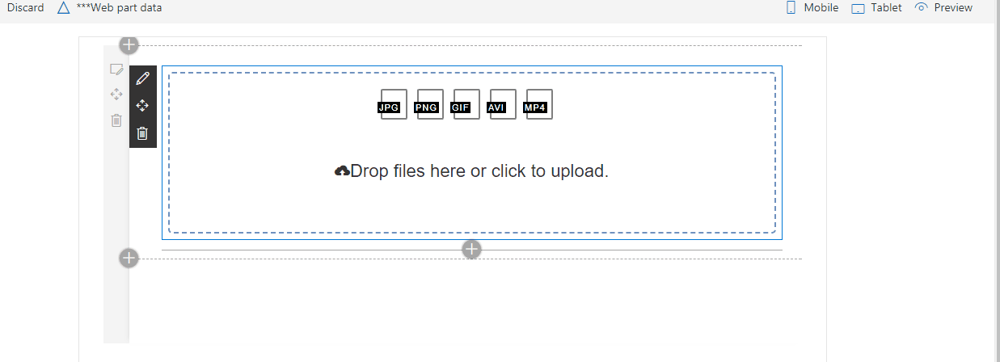

# React SPFileUpload client-side web part

## Summary
Sample file upload web part allowing users to upload multiple files to a document library or as item attachments.

## Used SharePoint Framework Version
SPFx v1.4

## Solution

Solution|Author(s)
--------|---------
SPFileUpload|Ramin Ahmadi

## Version history

Version|Date|Comments
-------|----|--------
1.0.0|February 14, 2018|Initial release

## Disclaimer
**THIS CODE IS PROVIDED *AS IS* WITHOUT WARRANTY OF ANY KIND, EITHER EXPRESS OR IMPLIED, INCLUDING ANY IMPLIED WARRANTIES OF FITNESS FOR A PARTICULAR PURPOSE, MERCHANTABILITY, OR NON-INFRINGEMENT.**

## Prerequisites

- Site Collection created under the **/sites/** Managed Path
- Existing document library or a list

## Features

This project contains sample client-side web parts built on the SharePoint Framework using React illustrating working with file upload web part.
This sample illustrates the following concepts on top of the SharePoint Framework:
- using React for building SharePoint Framework client-side web parts
- using React components for building file upload web part
- using [DropzoneJs](http://www.dropzonejs.com/) for uploading files
- uploading files to a document library
- uploading files as item attachments by getting the item ID from the query string parameter
- uploading files using RestAPI
- drag and drop feature for uploading files
- ability to remove uploaded files
- ability limit users to upload accepted file types

